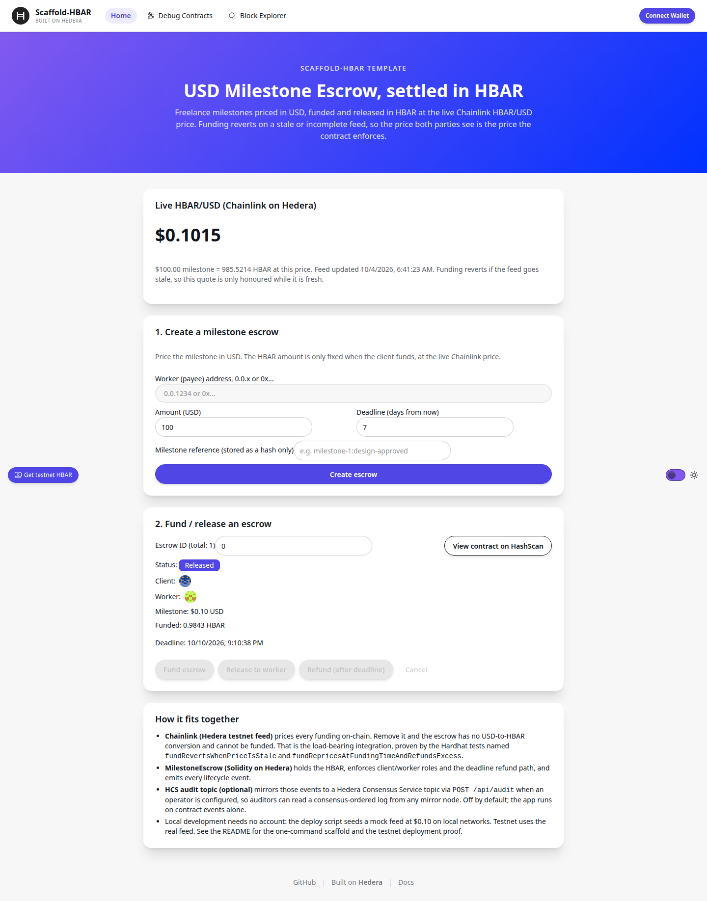
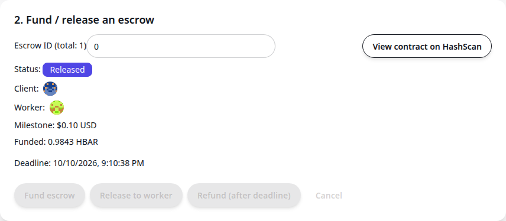

# Milestone Escrow — a Scaffold-HBAR template

USD-priced milestone escrow, settled in HBAR on Hedera.

A client and a worker agree a milestone in USD (say $100 for "design approved"). The client
funds the escrow in HBAR, converted at the **live Chainlink HBAR/USD price at the moment of
funding**. When the work is accepted the client releases; if the deadline passes, either party
can refund the client. Every lifecycle step is a contract event, and can optionally be mirrored
to a Hedera Consensus Service (HCS) topic as a consensus-ordered audit log.

```bash
npm create scaffold-hbar@latest -- --template tuannx/scaffold-hbar-milestone-escrow
```

That is the whole install path. Local development needs **no Hedera account and no
credentials**: the deploy script seeds a mock Chainlink feed at $0.10 on local networks.

## Demo

- **Video (60s):** [demo.mp4](https://github.com/tuannx/scaffold-hbar-milestone-escrow/releases/download/demo-v1/demo.mp4)
  — one-command scaffold, Chainlink-gated funding, the two on-chain findings below, and the
  testnet proof. Rendered with Remotion from the verified proof data (no screen capture).



The escrow after the lifecycle below: **Released**, $0.10 milestone funded with 0.9843 HBAR
at the live feed price.



## Why this template exists

Freelance and contractor milestones are quoted in fiat but settled in crypto. The naive
approach hard-codes an HBAR amount at creation time, so one party silently absorbs the price
move between agreement and funding. This template makes the oracle do the work:

| Claim | Evidence (test name, `packages/hardhat/test/MilestoneEscrow.test.ts`) |
|---|---|
| Funding re-prices at funding time, not creation time | `fundRepricesAtFundingTimeAndRefundsExcess` |
| A stale Chainlink round blocks funding | `fundRevertsWhenPriceIsStale` |
| An incomplete or non-positive round blocks funding | `fundRevertsOnIncompleteRound`, `fundRevertsOnNonPositivePrice` |
| Underpaying the live quote reverts | `fundUnderQuoteReverts` |
| Release pays the worker the funded amount | `releasePaysWorkerFundedAmount` |
| Only the client can release; deadline expiry refunds the client | `releaseRevertsForNonClient`, `refundAfterDeadlineReturnsClientFunds`, `refundBeforeDeadlineReverts` |

**The Chainlink integration is load-bearing.** Delete the feed and `quoteHbarTinybar` has no
price, `fundEscrow` cannot run, and the USD amount the worker agreed to has no HBAR
equivalent. It is not a price ticker displayed next to the app; the contract enforces it.

## Architecture

```
packages/hardhat/contracts/MilestoneEscrow.sol
  createEscrow(worker, usdMicros, deadline, referenceHash)   client opens a milestone
  quoteHbarTinybar(usdMicros) -> live Chainlink price, fresh or revert
  fundEscrow(id) payable   -> re-prices, escrows the quote, refunds overpayment
  releaseEscrow(id)        -> client pays the worker
  refundExpiredEscrow(id)  -> either party refunds the client after the deadline
  cancelEscrow(id)         -> client cancels an unfunded escrow

Chainlink AggregatorV3 (HBAR/USD)             Hedera services in play
  testnet 0x59bC155EB6c6C415fE43255aF66EcF0523c92B4a   Solidity escrow contract on Hedera
  (verified live 2026-10-03, see below)                  HCS topic audit mirror (optional,
                                                         proven live 0.0.10856884)

packages/nextjs
  app/page.tsx                 price card, create form, fund/release panel
  components/milestone/*       the escrow UI (scaffold hooks, no raw wagmi calls)
  services/hedera/auditLog.ts  server-side HCS submit (fail-soft when unconfigured)
  app/api/audit/route.ts       POST /api/audit mirrors lifecycle events to the topic
  app/api/dex/route.ts         GET /api/dex read-only SaucerSwap reference price
```

Second ecosystem leg (read-only): SaucerSwap's testnet REST API
(`test-api.saucerswap.finance`) prices WHBAR. `GET /api/dex` proxies it server-side and
the UI shows it next to the Chainlink price as an independent cross-check. The token id is
pinned (`0.0.15058`, WHBAR[new] — never a symbol lookup; spoof "HBAR" tokens exist).
Verified live on 2026-10-04: `priceUsd` 0.10150087 against the Chainlink $0.1015 above.
Honesty notes: keyless reads worked at that time, but SaucerSwap's docs state an API key
is required, so the UI fails soft and hides the figure if the call ever errors; and the
figure is an API reference price for display only — it is never fed into funding math.

USD amounts are stored in micro-USD (`1e6` = $1.00). Contract-side HBAR amounts are
tinybar (`1e8` = 1 HBAR): Hedera's EVM executes `msg.value`, balances, and payouts in
tinybar, while wallets send weibar (`1e18` = 1 HBAR) over JSON-RPC and the relay converts.
This split was verified on Hedera testnet while building the template: a funding call for a
$0.10 escrow sent `998525901663994467` weibar on the wire, reached the contract as
`99852590` tinybar, and reverted `Underfunded(required=978946962415680850, sent=99852590)`
against a wei-denominated quote. The contract now quotes and stores tinybar, and the UI
converts to weibar exactly once when sending. The milestone reference is stored as a `bytes32`
hash only — the underlying document never touches the chain.

## Quick start (local, offline)

Prerequisites: Node `>=20.18.3`, npm, git.

```bash
npm create scaffold-hbar@latest my-escrow -- --template tuannx/scaffold-hbar-milestone-escrow --ci --solidity-framework hardhat --package-manager npm
cd my-escrow

npm run hardhat:chain                       # local Hedera-forked node, terminal 1
npm run hardhat:deploy -- --network localhost
npm run next:dev                            # http://localhost:3000, terminal 2
```

On local networks the deploy script deploys `MockPriceFeed` at $0.10 and wires the escrow to
it, so create → fund → release works end-to-end with the burner wallet. Contract tests are
deterministic and offline:

```bash
cd packages/hardhat
npx hardhat test test/MilestoneEscrow.test.ts   # 12 passing
```

## Verify this template (the bounty gate, self-check)

`scripts/verify-template.sh` runs the eligibility gate the way a judge would — fresh
scaffold from GitHub, then install, lint, tests, build, and a boot probe:

```bash
scripts/verify-template.sh                      # this repo
scripts/verify-template.sh your-org/your-fork   # after forking
```

These exact steps were run green against the published repo on 2026-10-03/04 (G1/G4/G5);
the script simply makes them one command. The on-chain items (G6 testnet proof, G2/G3/G7/G8)
are evidenced below and in the repo history.

## Deploy to Hedera testnet

1. Create a deployer and fund it with testnet HBAR (the anonymous faucet auto-creates an
   account for an EVM address; observed issuance was 10 testnet HBAR/day on 2026-10-03):

   ```bash
   npm run hardhat:account:generate
   npm run hardhat:account        # note the EVM address, paste it at portal.hedera.com/faucet
   ```

2. Deploy against the live feed:

   ```bash
   npm run hardhat:deploy -- --network hederaTestnet
   npm run next:dev
   ```

   The default testnet feed is `0x59bC155EB6c6C415fE43255aF66EcF0523c92B4a` (HBAR/USD).
   We read it live while writing this template on 2026-10-03 13:53:58 UTC: answer
   `10164948` ($0.10164948), round fresh. Override with `PRICE_FEED_ADDRESS` for a different
   network or pair. `packages/nextjs/contracts/deployedContracts.ts` is regenerated by the
   deploy; do not edit it by hand.

### Testnet proof

Verified on Hedera testnet on 2026-10-03 (times CDT):

- Contract: `0xa7587e67546FCc219a36C4a726B532184c27af7f` —
  [HashScan contract](https://hashscan.io/testnet/contract/0xa7587e67546FCc219a36C4a726B532184c27af7f)
- Deployment transaction:
  [0x97fc7fd8f7f1642e1246002e109f55970c69006d7f17ef62f0fb21d5870fb721](https://hashscan.io/testnet/transaction/0x97fc7fd8f7f1642e1246002e109f55970c69006d7f17ef62f0fb21d5870fb721)
- Proof escrow ID `0`: created for `$0.10`, funded at the live Chainlink price
  (`price=10159039`, `funded=98434507` tinybar), then released to the worker.
  - Create: [0xc219bf6dfa3df2fcd0b86ad6d0ac4c560a2b45329ff8ef54591f0b0d922b386b](https://hashscan.io/testnet/transaction/0xc219bf6dfa3df2fcd0b86ad6d0ac4c560a2b45329ff8ef54591f0b0d922b386b)
  - Fund: [0x64bdb866334658485c9b43255d8a48fa540c0dda55c3fd90363564fc24e79002](https://hashscan.io/testnet/transaction/0x64bdb866334658485c9b43255d8a48fa540c0dda55c3fd90363564fc24e79002)
  - Release: [0x6107375e2cf8c993f520998829708aab87565e1a71d0f013c098986480b64766](https://hashscan.io/testnet/transaction/0x6107375e2cf8c993f520998829708aab87565e1a71d0f013c098986480b64766)
- Deployer account: `0.0.10843535` (`0x10d4B3332724F9525B964b3082CC90AC1A38C795`).
- An earlier deployment (`0x3d2D1E...e94b`, 3h staleness) completed the same lifecycle;
  it was replaced after a live `StalePrice` revert exposed the mis-calibrated window
  (see "Freshness window" under Customising).

## Optional: HCS audit mirror

Contract events are the source of truth. If you also want a Hedera-native, consensus-ordered
log that any mirror node can read without indexing contract logs:

```bash
# packages/nextjs/.env.local (server-side only, never commit real keys)
HEDERA_OPERATOR_ID=0.0.x
HEDERA_OPERATOR_KEY=<ecdsa hex>

npm run audit:create-topic -w @sh/nextjs   # prints HEDERA_AUDIT_TOPIC_ID=0.0.x
# copy the printed id into .env.local as HEDERA_AUDIT_TOPIC_ID, restart next:dev
```

The topic is created with the operator as **submit key** — a keyless topic would be
world-writable and worthless as an audit log. With nothing configured, `GET /api/audit`
returns `{ "configured": false }` and the UI simply skips mirroring. Keys are read on the
server only and never reach the browser. The operator key must be parsed as ECDSA
(`PrivateKey.fromStringECDSA`); passing the raw hex lets the SDK misread it as ED25519 and
topic creation fails precheck with `INVALID_SIGNATURE` — found and fixed while proving this
flow on testnet.

**Live on testnet:** topic
[`0.0.10856884`](https://hashscan.io/testnet/topic/0.0.10856884) carries sequence 1 mirroring
the escrow-0 release above (`EscrowReleased escrowId=0 tx=0x610737...6766`), written through
this template's own `POST /api/audit` route and readable from any mirror node.

## Environment variables

Declared in `template.json` and in each package's `.env.example`. Nothing is required for
local development.

| Variable | Package | Purpose |
|---|---|---|
| `PRICE_FEED_ADDRESS` | hardhat | Chainlink feed override (default: Hedera testnet HBAR/USD) |
| `MAX_STALENESS_SECONDS` | hardhat | Max accepted Chainlink round age at funding (default `21600`) |
| `HEDERA_OPERATOR_ID` | nextjs | HCS audit operator account |
| `HEDERA_OPERATOR_KEY` | nextjs | HCS audit operator ECDSA key, server-only |
| `HEDERA_AUDIT_TOPIC_ID` | nextjs | HCS topic created by `audit:create-topic` |
| `HEDERA_NETWORK` | nextjs | `testnet` (default) or `mainnet` for the audit mirror |

## Customising

- **Different price pair:** point `PRICE_FEED_ADDRESS` at any AggregatorV3 feed; the quote
  math reads `decimals()` from the feed, so no code change is needed.
- **Freshness window:** `MAX_STALENESS_SECONDS` defaults to 6h. Measured on Hedera testnet
  (2026-10-03), the HBAR/USD feed posted new rounds every ~1.2–2.7h; the previous 3h default
  reverted `StalePrice` whenever a round landed slowly — observed live at a feed age of
  ~3h03m. 6h is ~2× the slowest observed gap. Lower it for tighter freshness; do not raise it
  silently — the staleness window is the security parameter of this template, and mainnet
  operators should set it from their feed's heartbeat.
- **Mainnet:** deploy with `--network hederaMainnet` and set a mainnet feed address. The
  escrow holds real HBAR; the test suite is the specification, run it first.
  Mainnet readiness (prepared, not deployed — no mainnet deployment has been run from
  this template): the Chainlink HBAR/USD proxy on Hedera mainnet is
  `0xAF685FB45C12b92b5054ccb9313e135525F9b5d5`, verified live on 2026-10-04 via mainnet
  Hashio `latestRoundData` (answer 10151915 = $0.10151915, 8 decimals, fresh round; source:
  Chainlink docs feed directory, cross-checked on-chain). So:
  `PRICE_FEED_ADDRESS=0xAF685FB45C12b92b5054ccb9313e135525F9b5d5 npm run hardhat:deploy -- --network hederaMainnet`.
  Two mainnet-specific notes: the deployer must be a funded mainnet account (the key is
  read from runtime env, never committed), and the 6h staleness default was calibrated on
  testnet round cadence — measure the mainnet feed before tightening or loosening it.

## Limitations (stated, not hidden)

- One escrow = one milestone. Multi-milestone projects are multiple escrows; a project
  wrapper contract is the natural extension and is intentionally not included.
- No dispute arbitration. The client's release and the post-deadline refund are the whole
  resolution model; anything richer needs an arbiter role and a different trust analysis.
- Funding quotes are honoured only while the feed is fresh. If Chainlink stops updating,
  funding stops too — that is the intended failure mode, and the UI shows the feed timestamp
  so users can see it happening.
- `MockPriceFeed` (in `contracts/mocks/`) is a test double for local runs and unit tests. It
  is deployed automatically on local networks only. Never point `PRICE_FEED_ADDRESS` at a mock
  on a live network.

## Layout

```
template.json                 scaffold-hbar manifest (capabilities, defaults, env, outro)
packages/hardhat/             MilestoneEscrow + MockPriceFeed, deploy script, test suite
packages/nextjs/              Next.js app, escrow UI, /api/audit HCS mirror
AGENTS.md                     briefing for AI coding agents working in this template
```

## Licence

MIT. The escrow, tests, UI, and docs in this repository are original work built on the
Scaffold-HBAR starter (see `LICENCE`).
